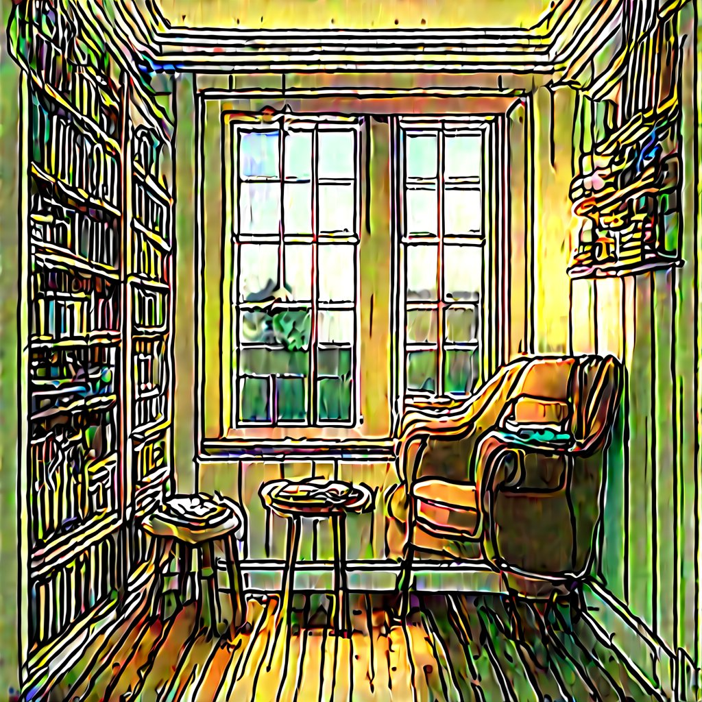

# SD Nonlinearity Lab

SD Nonlinearity Lab is an inference-time playground for Stable Diffusion activation experiments.  It lets you substitute, flatten, or remix UNet nonlinearities, gate those interventions by stage and denoising step, and compare patched vs. baseline renders side by side.  Nothing is fine-tuned—everything happens on-the-fly with deterministic seeds.

Stable Diffusion employs SiLU activations throughout its UNet; by substituting alternative nonlinearities (GELU, Mish, ReLU, etc.) or adjusting their curvature, we can explore how activation geometry shapes coherence, texture, and semantics inside a generative model. SD Nonlinearity Lab provides safe, reversible knobs for probing the role of different nonlinear functions in the diffusion process, enabling systematic experimentation with activation functions to understand their impact on image generation.

---

## Features

- **Activation remapping** – swap SiLU for `gelu`, `mish`, `hardtanh`, etc., with optional curvature flattening (`tau`) and identity blending (`beta`, `gamma`).
- **Per-stage control** – target any combination of `down`, `mid`, `up` blocks and specify start/end indices inside each stage.
- **Step scheduling** – enable patched activations only during a chosen denoising step window.
- **Variance matching** – optional affine correction keeps patched activations aligned with baseline mean/variance for cleaner A/B comparisons.
- **Baseline caching** – baseline renders are reused whenever the prompt/steps/cfg/seed/model tuple is unchanged.
- **Flask web UI** – tweak knobs from a dashboard with live activation plots, stage coverage schematics, and baseline previews.

---

## Demonstrations

Below are examples showing how different activation function settings transform the same prompt ("dreamlike reading nook"):

| SiLU (τ=1, β=0.15, γ=0.3) | HSwish (τ=1.1, γ=0.5) |
|:-------------------------:|:---------------------:|
|  |  |

Different choices of nonlinearity, curvature flattening (`tau`), identity blending (`beta`, `gamma`), and step targeting produce dramatically different artistic styles—from high-contrast, sketch-like outputs to soft, photorealistic renders.

---

## Installation

```bash
python -m venv .venv
. .venv/bin/activate
pip install --upgrade pip
pip install -r requirements.txt
```

Hugging Face models download on first use.  If you need private access, set `HF_HOME` and provide a token in `huggingface-cli login`.

---

## Usage

### CLI

```bash
python sd_unet_psy_acts.py \
  --prompt "dreamlike reading nook" \
  --out nook.png \
  --act mish --tau 1.3 --beta 0.25 --gamma 0.8 \
  --stages up,mid \
  --start-idx-up 2 --end-idx-up 9 \
  --step-start 10 --step-end 25 \
  --steps 30 --cfg 7.5 --seed 1337 \
  --calibrate
```

- `--start-idx-*` / `--end-idx-*` clamp which ResNet blocks are patched within each stage.
- `--step-start` / `--step-end` gate activation patches by denoising step (inclusive indices, blank end = full run).
- Baselines auto-save to `<out>_A_baseline.png`; patched render to `<out>_B_patched.png`.

### Web UI

```bash
python psy_web_ui.py
# visit http://127.0.0.1:7860
```

The dashboard mirrors CLI controls, adds persistence in local storage, and shows cached baselines beneath the patched preview.  Fields for End indices or steps accept blank values to indicate “∞”.

---

## Project Layout

| Path | Description |
|------|-------------|
| `sd_unet_psy_acts.py` | Activation patching CLI / library. |
| `psy_web_ui.py` | Flask UI server. |
| `web_out/` | Generated outputs + cached baselines. |
| `saved_web_out/` | Optional archive of previous runs. |
| `AGENTS.md` | Agent/automation guide. |
| `requirements.txt` | Python dependencies. |
| `sweep_call_psy_generator.py` | Legacy sweep driver for scripted parameter grids. |

---

## Parameter Sweeps

For bulk experiments there is a legacy sweep helper:

```bash
python sweep_call_psy_generator.py \
  --prompt "dreamlike reading nook" \
  --acts silu,mish,gelu_tanh \
  --taus 1.0,1.2,1.4 \
  --betas 0.0,0.15,0.3 \
  --stages up,mid \
  --start-idx 0 \
  --outdir sweep_out \
  --calibrate
```

- It shells out to `sd_unet_psy_acts.py` for each configuration, emplacing results and metrics in `sweep_out/`.
- The script predates per-stage start/end overrides and denoising step windows—those knobs default to the global `--start-idx` and always use the full step range.
- Extend it (e.g., add `--start-idx-up` / `--step-start`) if your sweep needs the newer controls.

---

## Tips & Troubleshooting

- **Images look identical** – try higher `tau`/`beta`, ensure the stage you’re targeting isn’t skipped by `start-idx`/`end-idx`, or disable the step window.
- **Blurrier results at high start indices** – decoder traversal runs low→high resolution; skipping early blocks means only the sharpening blocks are flattened, so expect softer outputs.
- **Out-of-memory** – keep FP16 (default), enable attention slicing (already on), or limit image resolution.
- **Reuse baselines** – toggling stage/step ranges no longer recomputes baselines; new baselines trigger only when the core text inputs change.

---

## Roadmap

- Image-to-image uploads in the web UI.
- Optional automatic parameter sweeps with contact sheet output.
- Extended analytics (LPIPS/CLIP score) for batch comparisons.

Pull requests and experiments welcome—open an issue to discuss new activation schedules or visualization ideas.  Have fun exploring how nonlinearities shape diffusion outputs!
